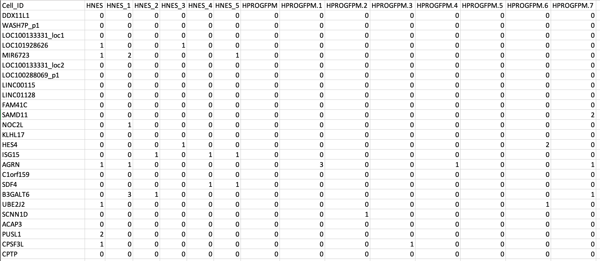
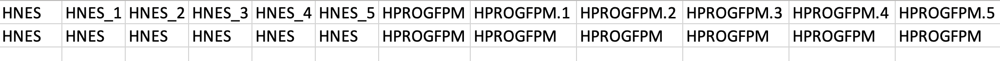

### CMI: Cellular conversion using Mechanistic driven Integrated workflow

A framework created using already available tools and databases, to perform cellular reprogramming computationally. 
To carry out tool specific task using the various tools available separately, the researchers need to go through the tools individually. CMI ease their work by integrating the tools at one place.
With this integration of the functionalities researchers can invest time in biological inferences and experimentally verifying the key modulators and their effects.

<hr>

### Steps:

1. Install all R requirements
2. git clone using installation command mentioned below 
3. cd into pipeline directory formed with clone command
4. run the setup.sh file
5. Install the feather file in data directory using the command mentioned below (Point 8)
6. Run the commands as per the requirement. (Refer commands section given below)


## Installation
git clone --depth 1 git@github.com:Avani7/Pipeline.git pipeline

<hr>

### Requirements
#### 1. Rstudio version used: R version 4.2.2
#### 2. R requirements
Use this command ro install R requirements
```
install.packages(c("gtools","Matrix", "nibble","dplyr","stringr","purrr","Rcpp","reshape2","umap","pheatmap", "igraph","GGally","ggplot2","RcisTarget","AUCell"))
```

#### 3. Python version used: Python 3.9
#### 4. Cytoscape version recommended: 3.9.1. Cytoscape needs to open in the background while running the workflow.  
#### 5. PathLinker app to be added to cytoscape using App manager in the software.  
#### 6. boost (Collection of portable C++ source libraries): 
`brew install boost`

User needs to define the CAPTH and LD_LIBRARY_PATH
###### For M1 users:
###### CAPTH = /opt/homebrew/include
###### LIBRARY_PATH = /opt/homebrew/lib

###### For Intel users:
###### CAPTH =/usr/local/include
###### LD_LIBRARY_PATH =/usr/local/lib

#### 7. wget: 
`brew install wget`
#### 8. feature file
User needs to download the feature file from https://resources.aertslab.org/cistarget/databases/old/homo_sapiens/hg19/refseq_r45/mc9nr/gene_based/ and add it in the data folder.
`curl -O https://resources.aertslab.org/cistarget/databases/old/homo_sapiens/hg19/refseq_r45/mc9nr/gene_based/hg19-tss-centered-10kb-10species.mc9nr.feather`
<hr>

### 9. TRRUST data netowrk in .tsv format
The file is already present in the data directory. If the user wants to download the latest data, it can be done using `curl -s 'https://www.grnpedia.org/trrust/data/trrust_rawdata.human.tsv' >> trrust_rawdata_human.tsv` command. User needs to make sure that the downloaded file is in the data directory.


### Definitions
<u>1. artefacts</u>: Directory provided by user, where all the results would be saved.  

<u>2. stage</u>: Part of the tool user wants to run.  

<u>3. params</u>: Input arguments required by the stage.

<hr>

### Input file preparation
All the input files should be saved in a folder called data.
Inputs files user needs to create:
Gene expression files
1. Starting cell population: create a .txt file with gene expression data of starting cell population. The rows should be gene names and columns should be sample IDs.
Eg: start.txt
2. Starting cell and terminal cell population combined: create a .txt file with gene expression data of both starting cell and terminal cell population. The rows should be gene names and columns should be sample IDs.
Eg: start_terminal.txt

3. Terminal cell population: create a .csv file with gene expression data of starting cell population. The rows should be gene names and columns should be sample IDs.
Eg: terminal.csv
4. annotation.txt: create a .txt file with lable IDs of the samples from starting cell and terminal cell population combined expression data. First row being the sample IDS similar to the starting cell and terminal cell population combined file and second two should be the cluster IDs of the population. Also one of the sample ID and cluster ID should be matching.


The starting cell population and terminal cell population cluster IDs to be enerted as parameters should match the one in the annotations files.

<hr>

### Commands
- <u>stage</u>: all (TransSynW + PAGA + SIGNET + TRRUST + Cytoscape + Uniprot)  

    cmi run all --artefacts ./artefacts/[directory_name] --params [start_cell population] [start and terminal_cell population] [annotation file] [terminal cell cluster ID] [startaing cell cluster ID] ./data/terminal.csv ./data/trrust_rawdata_human.tsv  

    Eg: cmi run all --artefacts ./artefacts/temp --params start.txt start_terminal.txt annotation.txt HPROGFPM HNES ./data/terminal.csv ./data/trrust_rawdata_human.tsv

- <u>stage</u>: generate_hypothesis (TransSynW)  

    cmi run generate_hypothesis --artefacts ./artefacts/[directory_name] --params [start_cell population] [start and terminal_cell population] [annotation file] [terminal cell cluster ID]

    Eg: cmi run generate_hypothesis --artefacts ./artefacts/[directory_name] --params start.txt start_terminal.txt annotation.txt HPROGFPM

- <u>stage</u>: mechanistic insights (TransSynW + PAGA)  

    cmi run mechanistic insights --artefacts ./artefacts/[directory_name] --params [start_cell population] [start and terminal_cell population] [annotation file] [terminal cell cluster ID] [startaing cell cluster ID]

    Eg: cmi run mechanistic_insights --artefacts ./artefacts/temp --params start.txt start_terminal.txt annotation.txt HPROGFPM HNES

- <u>stage</u>: grn inference (SIGNET)  

    cmi run grn_inference --artefacts ./artefacts/[directory_name] --params ./data/terminal.csv  

    Eg: cmi run grn_inference --artefacts ./artefacts/temp --params ./data/terminal.csv

- <u>stage</u>: trrust analysis (TRRUST)  

    cmi run trrust_analysis --artefacts ./artefacts/[directory_name] --params ./data/trrust_rawdata_human.tsv

    Eg: cmi run trrust_analysis --artefacts ./artefacts/temp --params ./data/trrust_rawdata_human.tsv 


- <u>stage</u>: gene network (Cytoscape)  

    cmi run create_network --artefacts ./artefacts/[directory_name] --params ./artefacts/[directory_name]/Trrust_Analysis/trrust_analysis.csv

    Eg: cmi run create_network --artefacts ./artefacts/temp --params ./artefacts/temp/Trrust_Analysis/trrust_analysis.csv 

- <u>stage</u>: functional analysis (Uniprot)  

    cmi run functional_analysis --artefacts ./artefacts/[directory_name] /Trrust_analysis/transsynw_genes.csv /Trrust_analysis/signet_genes.csv  

    Eg: cmi run functional_analysis --artefacts ./artefacts/temp /Trrust_analysis/transsynw_genes.csv /Trrust_analysis/signet_genes.csv
